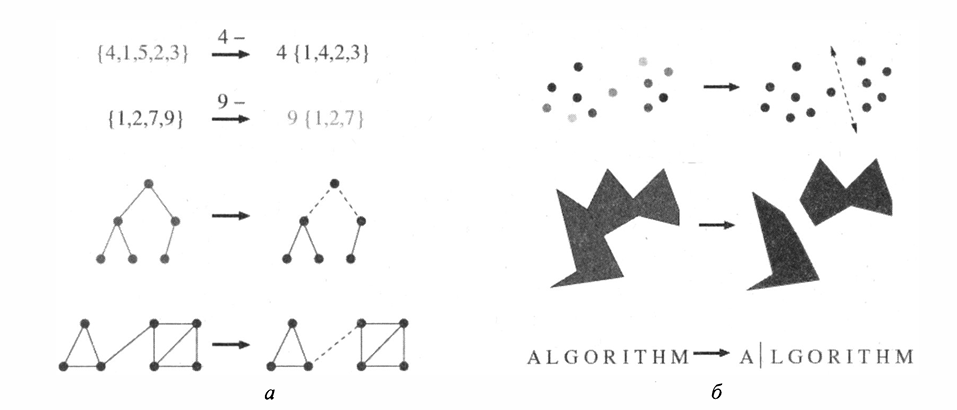

# ?? ??????????? ??????? ? ??????????

## ?? ???????? ?????????
?????? ????????? ?????? ????? **????????? ?? ??????? ??????????? ?????**, ??? ?????? ?? ?????????? ??????????? ??? ??????????? ?????????.

## ?? ??????? ??????????? ????????

### 1. ?? ????????????
- ?????? ?????? ??????? ???????????? `{1,...,n}`, ??????? ???????????? ?????????? `n-1` ?????????
- ??????:  
  ??????? `4` ?? `{4,1,5,2,3}` ? ???????????? ? `{1,4,2,3}`  
  *(????????????? ????????? ??????? ?????????)*

### 2. ?? ????????????
- ????? ????????? `{1,...,n}` ???????? ???????????? `{1,...,n-1}`
- ??????:  
  `{a,b,c,d}` ? ??????? `d` ? `{a,b,c}`

### 3. ?? ???????
| ????????? ??????? | ????????? |
|-------------------|-----------|
| **??????** ??| ????????? ??????????? |
| **????** ??  | ??????? ?????? |
### 4. ??? ?????
- ???????? ??????? ? ??????? ????
- ?????????? ?????? ?? 2 ?????? + ?????? ?????:

5. ? ????? (?????? ?????)
?????????? ????? ? 2 ??????? ??????

?????? ?????????????:

????|??? ? ???? + ???

6. ?? ??????????????
?????????? ????????? ?????? ?????? ? 2 ??????? ??????????????

?????? ??? 6-?????????:

```
graph TD
  A[?????????????] --> B[???????????????]
  A --> C[???????????]
```
7. ?? ??????
???????? ??????? ??????? ? ????? ???????? ??????

??????:
"Hello" ? "ello"

?? ???????? ??????
???????? ??????????? ???????? ?? ???????????, ??????? ????? ???????????????

??? ??????? ???? ???????? ???? ????:

??????? ?????? (?????? ??????, ???? ?????? ? ?.?.)

??????? ????????? ?? ?????????

??????????? ????????? ????? ??????????:

?????????? (divide)

????????? ?????? (conquer)

??????????? ??????????? (combine)

?? ?????: ??? ?????????????? ??????????? ?????????? ??????? ??????????:

??? ????????? ?????? ?? ??????? ?????

????? ????? ??????? ??????

??? ????????????? ?????????? ????????

